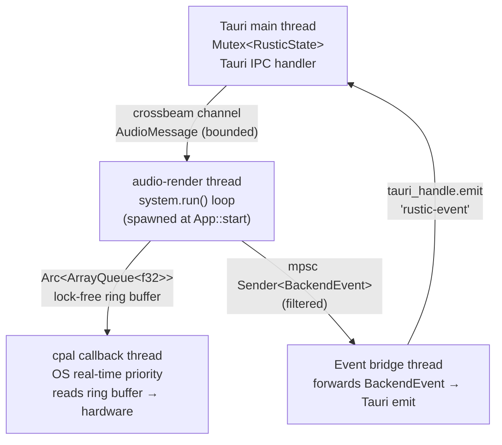
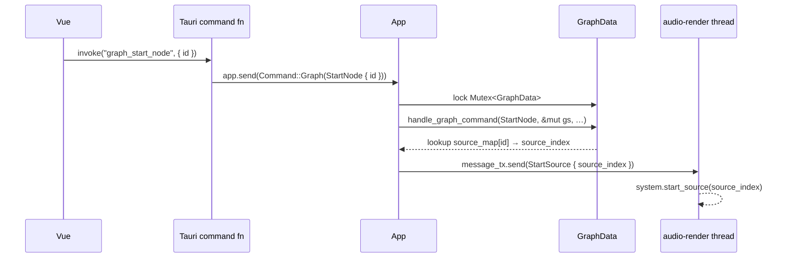
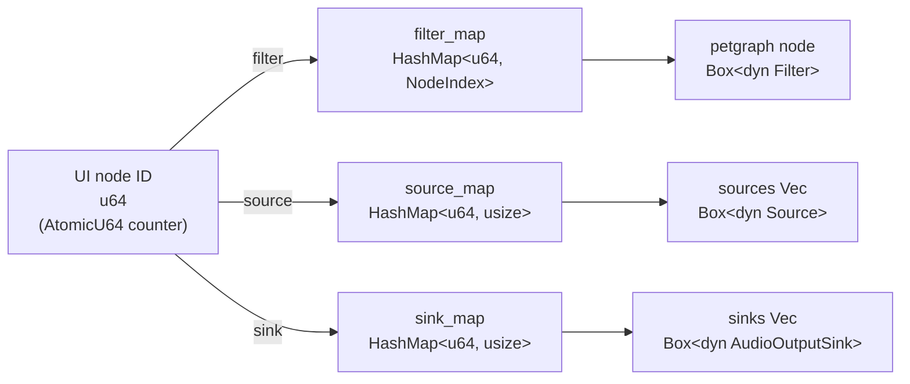
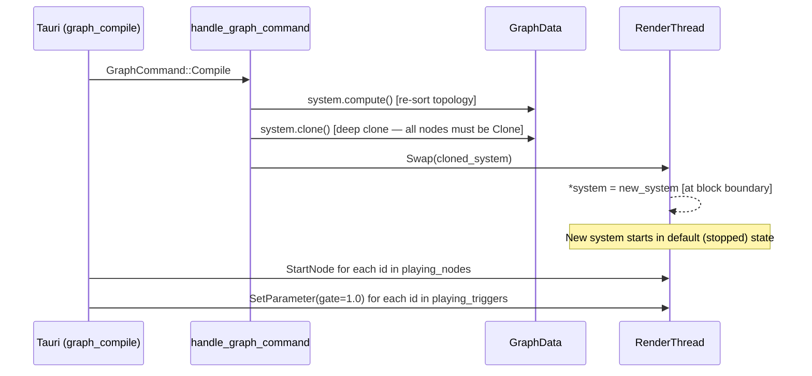
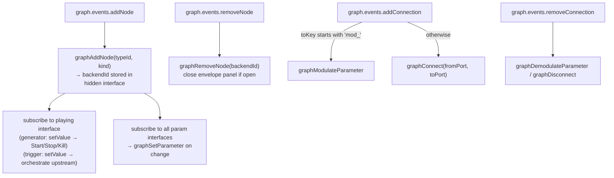

# Rustic — Architecture & Release Notes

> Last updated: 2026-03-05 (post node-controls rework + Trigger node)

---

## Table of Contents

1. [Workspace layout](#1-workspace-layout)
2. [Thread model](#2-thread-model)
3. [Message passing](#3-message-passing)
4. [Graph system internals](#4-graph-system-internals)
5. [Frontend bridge](#5-frontend-bridge)
6. [Adding a new filter](#6-adding-a-new-filter)
7. [Release checklist](#7-release-checklist)

---

## 1. Workspace layout

```
rustic/                 ← core audio library (engine, no UI dependency)
rustic-meta/            ← shared metadata types (FilterInfo, Parameter, MixMode, …)
rustic-derive/          ← proc-macro: #[derive(FilterMetaData)]
rustic-toolkit/         ← Tauri desktop app (frontend + Rust IPC commands)
rustic-keyboard/        ← MIDI/keyboard input helper
```

`rustic` has no UI dependency. `rustic-toolkit` owns all play-state bookkeeping and
UI orchestration. The core library only receives audio-rendering commands.

---

## 2. Thread model



**Key invariant**: `handle_graph_command()` runs synchronously in the Tauri IPC
thread, protected by `Mutex<GraphData>` inside `App::graph_system`. There is no
separate command thread.

The cpal callback is allocation-free and lock-free by design — it only pops from
the `ArrayQueue` ring buffer. On underrun it fills with silence and increments an
atomic counter in `SharedAudioState`.

---

## 3. Message passing

### 3.1 Frontend → Backend



### 3.2 AudioMessage variants

```rust
enum AudioMessage {
    Instrument(InstrumentAudioMessage),  // note-on / note-off (instrument system)
    Graph(GraphAudioMessage),            // live graph control (visual graph editor)
    Shutdown,
}

enum GraphAudioMessage {
    Swap(System),           // hot-swap entire compiled graph
    Clear,                  // replace with silent graph
    StartSource   { source_index },
    StopSource    { source_index },      // graceful: plays through release envelope
    KillSource    { source_index },      // immediate: skips release
    SetParameter  { node_index, param_name, value },    // filter param
    SetSourceParameter { source_index, param_name, value },
    AddModulation    { from_source, target, param_name },
    RemoveModulation { from_source, target, param_name },
}
```

### 3.3 Render loop (pseudo-code)

```rust
loop {
    // Drain all pending control messages first (non-blocking)
    while let Ok(msg) = message_rx.try_recv() {
        process_audio_message(&mut system, msg);
    }

    // Throttle: if ring buffer is full, yield
    if audio_queue.len() >= target_samples {
        thread::sleep(Duration::from_micros(100));
        continue;
    }

    // One DSP block
    system.run();
    let frames = system.get_sink(0).consume();

    // Push stereo-interleaved samples to ring buffer
    for [l, r] in frames {
        audio_queue.push(l);
        audio_queue.push(r);
    }

    // Broadcast chunk for waveform display / recording (if Audio category enabled)
    event_tx.send(BackendEvent::Audio(AudioEvent::Chunk(…)));
}
```

### 3.4 BackendEvent (render → frontend)

```rust
// Wrapped in EventSender: atomic bitmask filters which categories are forwarded
enum BackendEvent {
    Status(StatusEvent),       // AudioStarted, AudioStopped, …
    Audio(AudioEvent),         // Chunk(Vec<f32>) — every block, disabled by default
    Diagnostics(…),            // CPU, latency, underruns
    Error(ErrorEvent),         // ThreadPanic, GraphError, CommandFailed
}
```

Default filter: **Status + Error only**. Enable audio chunks with:
```rust
App::start(EventFilter::default().with(EventCategory::Audio))
```

The toolkit's event bridge thread (`lib.rs::setup`) forwards events as Tauri events
(`"rustic-event"`) which Vue can listen to with `listen("rustic-event", handler)`.

---

## 4. Graph system internals

### 4.1 ID mapping (two layers)



**Index stability**: `NodeIndex` values are stable after filter removal (petgraph
marks slots vacant). Source/sink indices are `Vec` positions and shift on removal.
After `Vec::remove(idx)`, `graph_handler.rs` decrements all stored indices `> idx`:

```rust
for v in source_map.values_mut() {
    if *v > removed_idx { *v -= 1; }
}
```

### 4.2 System structure

```rust
struct System {
    // petgraph DAG: edge weight = (from_port, to_port)
    graph: StableGraph<Box<dyn Filter>, (usize, usize)>,

    // Each source fans out to N (filter, input_port) targets
    sources: Vec<(Box<dyn Source>, Vec<(NodeIndex, usize)>)>,
    sinks:   Vec<Box<dyn AudioOutputSink>>,

    mix_modes:   HashMap<NodeIndex, MixMode>,   // Sum | Average | Max | Min
    mod_wires:   Vec<ModWire>,                   // CV modulation connections
    topo_order:  Vec<NodeIndex>,                 // cached Kahn topological sort
}
```

### 4.3 Compile & hot-swap flow



### 4.4 CV modulation (mod wires)

A `ModWire` routes the **block-mean** of one source's output to overwrite a named
parameter on a filter or another source each `run()` call. The `mod_*` input ports
in the UI (e.g. `mod_frequency`) trigger `Modulate` / `Demodulate` commands that
add/remove `ModWire` entries from the running system.

---

## 5. Frontend bridge

### 5.1 Node lifecycle (useGraphBridge composable)



### 5.2 Play-state machine

```typescript
// NodeControls.vue modelValue: 'idle' | 'playing' | 'releasing' | 'killed'
//
// idle / releasing / killed  →  ▶ enabled,  ⏸ disabled, ✕ disabled
// playing                    →  ▶ disabled, ⏸ enabled,  ✕ enabled

// useGraphBridge subscription (generator):
node.inputs.playing.events.setValue.subscribe((value) => {
    if (value === 'playing')   graphStartNode(id)
    if (value === 'releasing') graphStopNode(id)   // StopSource → graceful release
    if (value === 'killed')    graphKillNode(id)   // KillSource → immediate
    if (value === 'killed')    nextTick(() => playing.value = 'idle')
})

// useGraphBridge subscription (Trigger node):
node.inputs.playing.events.setValue.subscribe((value) => {
    const upstream = connections
        .filter(c => c.to.nodeId === node.id)
        .map(c => graph.nodes.find(n => n.id === c.from.nodeId))
        .filter(n => getNodeKind(n) === 'Generator')

    if (value === 'playing') {
        graphTriggerPlay(triggerId)          // SetParameter(gate=1.0)
        upstream.forEach(n => n.inputs.playing.value = 'playing')
    }
    if (value === 'releasing') {
        graphTriggerStop(triggerId)          // SetParameter(gate=0.0)
        upstream.forEach(n => n.inputs.playing.value = 'releasing')
    }
    if (value === 'killed') {
        graphTriggerKill(triggerId)          // SetParameter(gate=-1.0)
        upstream.forEach(n => n.inputs.playing.value = 'idle')
        nextTick(() => playing.value = 'idle')
    }
})
```

### 5.3 Envelope editor

The panel reads from and writes to **hidden node interfaces** (not rendered in the
node card). For generator nodes these are populated by `buildGeneratorInputs()` from
the `ENVELOPE_PARAMS` set. For Trigger nodes they are populated by the special-case
registration block. The bridge's `setValue` subscription picks up writes and forwards
them to the backend via `graphSetParameter` — no separate IPC path needed.

```typescript
const ENVELOPE_PARAMS = new Set([
    "attack", "decay", "sustain", "release",
    "attack_curve", "decay_curve", "release_curve",
    "attack_cp_t", "decay_cp_t", "release_cp_t",
])

// In buildGeneratorInputs / Trigger special-case:
inputs[field] = () =>
    new NodeInterface<number>(field, def).setPort(false).setHidden(true)

// In Graph.vue — writing a value triggers the bridge subscription automatically:
function setEnvParam(name: string, value: number) {
    envelopeNode.value.inputs[name].value = value  // subscription does the IPC call
}
```

### 5.4 Compile-state replay

```rust
// RusticState tracks which nodes are currently playing
pub struct RusticState {
    pub playing_nodes:    Mutex<HashSet<u64>>,   // generator IDs
    pub playing_triggers: Mutex<HashSet<u64>>,   // Trigger node IDs
}

// graph_compile re-sends start commands after the Swap:
pub fn graph_compile(state) -> Result<(), AppError> {
    state.app.send(Command::Graph(GraphCommand::Compile))?;

    for id in state.playing_nodes.lock().unwrap().clone() {
        state.app.send(Command::Graph(StartNode { id }))?;
    }
    for id in state.playing_triggers.lock().unwrap().clone() {
        state.app.send(Command::Graph(SetParameter { node_id: id, param_name: "gate", value: 1.0 }))?;
    }
}
```

---

## 6. Adding a new filter

### With the derive macro (recommended)

```rust
// src/core/filters/mymodule/myfilter.rs
use rustic_derive::FilterMetaData;
use crate::core::{Block, graph::{Entry, Filter}};

#[derive(FilterMetaData, Clone, Debug, Default)]
pub struct MyFilter {
    #[filter_source]
    source: Block,
    #[filter_parameter(range, 0.0, 1.0, 0.5)]  // min, max, default
    amount: f32,
    // #[filter_parameter(float, 1.0)]           // unconstrained float, default
    // #[filter_parameter(toggle, true)]          // checkbox, default
}

impl Entry for MyFilter {
    fn push(&mut self, block: Block, _port: usize) { self.source = block; }
}

impl std::fmt::Display for MyFilter {
    fn fmt(&self, f: &mut std::fmt::Formatter) -> std::fmt::Result { write!(f, "My Filter") }
}

impl Filter for MyFilter {
    fn transform(&mut self) -> Vec<Block> {
        let a = self.amount;
        vec![self.source.iter().map(|fr| [fr[0] * a, fr[1] * a]).collect()]
    }
    fn as_any_mut(&mut self) -> &mut dyn std::any::Any { self }
}
```

The derive macro automatically generates `MetaFilter::set_parameter()`,
`MetaFilter::metadata()`, and `inventory::submit!(FilterRegistration { … })`.
Export from `filters/mymodule/mod.rs` and `filters/mod.rs::prelude`. The frontend
discovers it via `getGraphMetadata()` without any manual registration.

### Without the derive macro (e.g. TriggerFilter)

Needed when the struct can't use the macro (arrays, complex state, gate logic, …):

```rust
impl MetaFilter for MyFilter {
    fn set_parameter(&mut self, name: &str, value: f32) { /* manual match */ }
    fn metadata() -> FilterInfo {
        FilterInfo {
            name: "My Filter",
            description: "…",
            inputs: vec![
                FilterInput { label: Some("Input"), parameter: None },           // audio port
                FilterInput { label: None, parameter: Some(Parameter::Range {    // slider
                    title: "Amount", field_name: "amount",
                    min: 0.0, max: 1.0, default: 0.5, value: 0.5,
                })},
            ],
            outputs: 1,
        }
    }
}

fn create_my_filter() -> Box<dyn Filter> { Box::new(MyFilter::default()) }
fn my_filter_info()   -> FilterInfo      { MyFilter::metadata() }
inventory::submit!(crate::meta::FilterRegistration { info: my_filter_info, create: create_my_filter });
```

---

## 7. Release checklist

### Blockers — must fix before tagging

**B1 · `'releasing'` state never auto-resets to `'idle'`**

After clicking ⏸ on a generator or Trigger node, the UI stays in `'releasing'`
indefinitely even after the release envelope has silenced the source. The ▶ button
remains accessible so users can restart, but the persistent state is misleading.

Two viable fixes:

- **Backend event** (correct, more work): add `SourceStopped { source_index }` to
  `BackendEvent`. Emit it from the render thread when `system.is_source_active(i)`
  transitions to `false`. Forward via the event bridge. In `useGraphBridge`, listen
  on `"rustic-event"` and reset `playing.value = 'idle'` for the matching node.

- **Frontend timer** (quick, slightly fragile): after the `setValue` subscription
  sets `'releasing'`, schedule a `setTimeout` of `(release_ms + 200)` ms read from
  the node's `release` interface, then conditionally reset to `'idle'`.

**B2 · Same issue for Trigger nodes** — the Trigger's `playing` state stays
`'releasing'` after its own ADSR release completes.

---

### Should-have — before shipping

**S1 · Commit and version bump**

All changes from the node-controls / Trigger session are uncommitted. Current
versions: `rustic 0.1.0`, `rustic-toolkit 1.0.0`.

**S2 · Trigger node detection is title-based**

`playSelected` / `stopSelected` in `Graph.vue` check `node.title === "Trigger"`.
If the filter name changes in metadata, this silently breaks. Consider adding a
`nodeTypeId` hidden interface to filter nodes (already done for generators), or a
`getNodeVariant()` helper that returns `"Trigger" | "Generator" | "Filter" | "Sink"`.

**S3 · Production bundle size**

`npm run build` warns about a ~1.5 MB chunk (BaklavaJS + renderer). Not a
blocker but worth a `build.rollupOptions.output.manualChunks` split before a
public release.

---

### Nice-to-have — post-release

- **`'releasing'` visual distinction**: a pulsing border on the node while fading
  out would communicate the transient state without needing a backend event.
- **Trigger: upstream count badge**: show `n connected` in the Trigger node header.
- **Unit tests for `TriggerFilter`**: gate state-machine edge cases (immediate
  release after attack start, kill mid-release, `gate=1.0` restart mid-release).
- **CHANGELOG.md** documenting Stop/Kill semantics, Trigger node, and
  compile-state replay.
- **EventCategory::Audio pipeline**: chunks are emitted every block but the
  toolkit's event bridge discards them by default. If real-time waveform display
  is wanted, enable the category and wire up a canvas renderer in the frontend.
