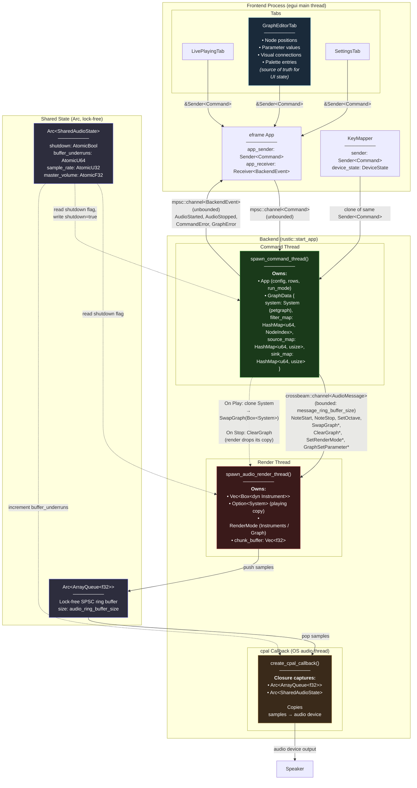

# Rustic

<div align="center">
    
    
    
    
</div>

Rustic is a **modular audio synthesis framework** written in Rust that lets you build real‑time DSP pipelines, musical instruments, audio effects, and full‑stack synthesis applications.

## Quick start

```bash
git clone https://github.com/minigrim0/rustic.git
cd rustic
```

Follow the *Getting started* section to create a project, run the frontend, and explore the demo apps.

## Components

The project consists of multile components.

- `rustic/` - The core library, responsible for managing the audio thread and synthesis
- `rustic-meta/` + `rustic-derive/` - Handles deriving metadata for filter structures in the core library
- `rustic-toolkit/` - A frontend using the library for audio analysis, filter graph building and testing (still heavily WIP). Serves as a playground for audio synthesis.
- `frontend/` - Deprecated - Initial attempt at making a frontend for actually playing music, might disappear entirely in the near future.

### Core library architecture

The library implements a real-time-safe audio system using three threads that communicate via lock-free data structures:

#### Thread Responsibilities:

- **Command Thread** (`spawn_command_thread`): Receives Commands from the frontend, validates them, translates to AudioMessage enum, and forwards to render thread. Maintains the App state machine.
- **Render Thread** (`spawn_audio_render_thread`): Owns all Instrument instances, processes AudioMessage queue, calls tick() on instruments, produces audio samples, pushes to ArrayQueue<f32>.
- **CPAL Callback** (`create_cpal_callback`): Real-time audio thread managed by cpal, pulls samples from ArrayQueue<f32>, writes to audio device buffer. Must never block.



## Development

### Pre‑commit hooks

The repository uses [pre‑commit](https://pre-commit.com/) to enforce
formatting (rustfmt) and to run the default test suite.

```bash
pre-commit install          # install hooks
pre-commit run --all-files  # test hooks locally
```

### Documentation

Documentation is automatically built & published to GitHub Pages on every push to main.

[https://minigrim0.github.io/rustic/](https://minigrim0.github.io/rustic/)

### Get involved

- Clone the repo:

```bash
git clone https://github.com/minigrim0/rustic.git
cd rustic
```

- Build & run the examples:

```bash
cargo run --example drum_machine
```

- For frontend development:

```bash
cargo tauri dev
```
