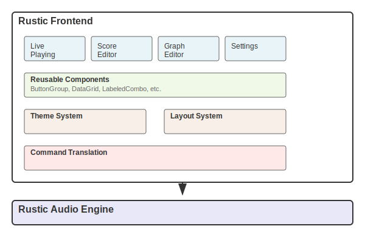

# Rustic Frontend Architecture

## Overview

The Rustic Frontend is a graphical user interface for the Rustic audio processing engine. It provides a set of interactive tabs for different functionalities including live playing, score editing, audio graph editing, and application settings. The frontend is built with the egui framework for immediate-mode GUI rendering.

## Structure

The codebase is organized into the following primary modules:

### Core Modules

- **main.rs**: Application entry point and main app structure
- **lib.rs**: Library exports for modules and components
- **app.rs**: Core application state and lifecycle management
- **manager.rs**: Resource management for textures and fonts
- **mapping.rs**: Key mapping for musical input
- **render.rs**: Rendering utilities and helpers
- **translator.rs**: Translation of events to commands

### Tabs

The application is organized into tabs, each providing different functionality:

- **LivePlayingTab**: Real-time instrument performance with keyboard input
- **ScoreEditorTab**: Musical score editing with staff notation
- **GraphEditorTab**: Visual node-based audio processing graph editor
- **SettingsTab**: Application configuration and preferences

Each tab implements the `Tab` trait, which defines a common interface for UI rendering and event handling.

### UI Components

To ensure consistency across the application, we've implemented reusable UI components:

- **ButtonGroup**: Standardized button groups with consistent styling
- **DataGrid**: Tabular data display with headers and styling options
- **LabeledCombo**: Combo box (dropdown) with associated label
- **LabeledSlider**: Slider with associated label
- **SectionContainer**: Container for grouping related UI elements
- **StatusMessage**: Feedback messages with different severity levels

### Theming

The application uses a custom theming system that provides:

- Multiple theme options (Dark, Light, High Contrast, Custom)
- Consistent color palette and styling
- UI scaling
- Standardized spacing and layout

## Communication

The frontend communicates with the Rustic audio engine through message passing:

- Commands are sent from the frontend to the audio engine via an MPSC channel
- Responses and events flow back from the audio engine to the frontend
- The `Commands` enum defines all possible actions that can be performed

## Diagram

## Design Principles

1. **Consistency**: Use reusable components and consistent styling across the application
2. **Modularity**: Keep functionality separated into logical modules and components
3. **Responsiveness**: Ensure the UI remains responsive while audio processing occurs in a separate thread
4. **Extensibility**: Make it easy to add new features or enhance existing ones

## Future Improvements

1. **State Management**: Implement a more robust state management pattern
2. **Configuration Persistence**: Add proper configuration saving/loading
3. **Testing**: Add comprehensive unit and integration tests
4. **Accessibility**: Enhance keyboard navigation and screen reader support
5. **Plugin System**: Add support for third-party plugins or extensions

## Architecture Decisions

### Immediate Mode GUI

We chose egui as our GUI framework because:
- It's lightweight and performant
- It simplifies state management
- It has a clean, declarative API that's easy to understand
- It works well with Rust's ownership model

### Tab-Based Interface

The tab-based interface was selected to:
- Provide clear separation between different functional areas
- Allow users to focus on one task at a time
- Simplify navigation and reduce cognitive load

### Reusable Components

We extracted common UI patterns into reusable components to:
- Ensure visual consistency
- Reduce code duplication
- Simplify maintenance and updates
- Provide a unified user experience

### Message Passing

We use message passing for communication between the frontend and audio engine to:
- Maintain clear separation of concerns
- Avoid blocking the UI thread during audio processing
- Support future enhancements like network communication or serialization
