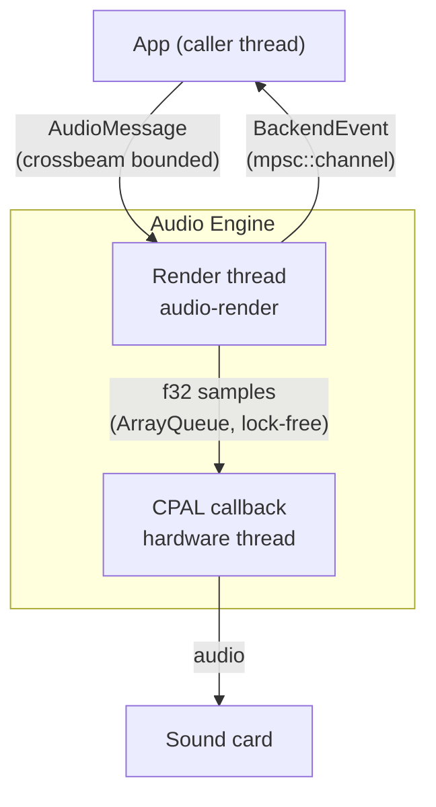
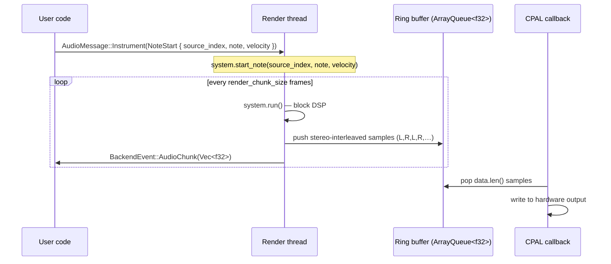

# Rustic

## Project Overview

Rustic is a frontend-agnostic core library for audio synthesis. It provides composable DSP primitives — generators, envelopes, filters, and a node graph — behind a lock-free, real-time-safe audio pipeline. The same engine can be embedded in GUI applications, CLI tools, or test harnesses without modification.

## Architecture

### Thread model

The engine runs three concurrent roles:

| Role | Thread | Responsibility |
|---|---|---|
| **App** | caller | Creates `App`, loads instruments, calls `start()`, sends `AudioMessage`s directly to the render thread, receives `BackendEvent`s |
| **Render** | `audio-render` | Runs `system.run()` per block, writes stereo samples to the ring buffer, emits `BackendEvent`s |
| **CPAL callback** | hardware | Pops samples from the ring buffer, writes to the sound card |



### Data flow



### Ring buffer

The ring buffer is a `crossbeam::queue::ArrayQueue<f32>`. Samples are always **stereo-interleaved**: `[L, R, L, R, …]`. The render thread produces two samples per mono frame; the CPAL callback consumes exactly `buffer_size × channels` samples per callback. On underrun the callback fills with silence and increments a shared counter.

Default capacity: **8 192 samples** (~93 ms at 44.1 kHz stereo). The render thread throttles at `target_latency_ms` (default 50 ms) and never fills the buffer beyond that threshold, keeping command-to-sound latency low.

### Render pipeline

All audio is processed through a single `System` graph. There is no separate "instrument mode" — every instrument is compiled into a `Source` node inside the graph before playback starts.

On `App::start()`, `AudioGraph::compile()` assembles all loaded instruments into one `System` and passes it to the render thread. The render thread calls `system.run()` every block, draining all pending `AudioMessage`s between blocks.

To swap a new graph at runtime, send `AudioMessage::Graph(GraphAudioMessage::Swap(system))`. The render thread replaces its current system atomically between blocks.

### BackendEvent channel

The render thread sends `BackendEvent`s back to the caller via an `mpsc::channel`:

| Variant | Description |
|---|---|
| `AudioStarted { sample_rate }` | Engine is ready |
| `AudioStopped` | Shutdown complete |
| `AudioChunk(Vec<f32>)` | Stereo-interleaved samples from the last block — use `.step_by(2)` to extract L or R. Useful for offline analysis and waveform capture. |
| `BufferUnderrun { count }` | Ring buffer was empty during a callback |
| `CommandError { command, error }` | A command failed |
| `GraphError { description }` | Graph topology error (cycle, missing sink, …) |
| `Metrics { cpu_usage, latency_ms }` | Periodic diagnostics |
| `OutputDeviceList { devices }` | Available output devices |
| `OutputDeviceChanged { device }` | Active output device changed |

## DSP Primitives

### Generators

A `SingleToneGenerator` produces one oscillator voice:
- **Waveform** — `Sine`, `Square`, `Sawtooth`, `Triangle`, `WhiteNoise`
- **FrequencyRelation** — `Ratio`, `Harmonic`, `Semitones`, `Constant`, `Offset` relative to a base frequency
- **Amplitude envelope** — any `dyn Envelope`
- **Pitch envelope** — optional `dyn Envelope` that scales `time_elapsed` per sample

A `MultiToneGenerator` combines multiple `SingleToneGenerator`s under a shared base frequency, optional global amplitude and pitch envelopes, and a `MixMode` (`Sum`, `Average`, `Multiply`, `Max`).

### Envelopes

Envelopes implement `Envelope::at(time: f32, note_off: f32) -> f32`. Built-in segments:

- `LinearSegment(start, end, duration)`
- `BezierSegment(start, end, duration, control_point)`
- `ConstantSegment(value, Option<duration>)`

`ADSREnvelope` composes four segments (attack, decay, sustain, release). The sustain level is the end value of the decay segment.

### Sources

Sources implement the `Source` trait and feed audio into the graph. Two built-in source types wrap a `MultiToneGenerator`:

- **`MonophonicSource`** — single voice, one note at a time. Suitable for percussive instruments (kick, snare). When `track_pitch` is false, the source always plays at its configured base frequency regardless of what note triggers it.
- **`PolyphonicSource`** — voice pool, multiple simultaneous notes. Each voice is an independent generator instance. Suitable for melodic instruments (keyboard).

### Filters

Filters implement `Filter::process(input: Frame) -> Frame` and optionally `set_parameter(name, value)`:

`LowPassFilter`, `HighPassFilter`, `BandPass`, `GainFilter`, `Clipper`, `Compressor`, `Tremolo`, `DelayFilter`, `MovingAverage`

### Instruments

Instruments implement the `Instrument` trait:

```rust
pub trait Instrument: Debug + Send + Sync {
    fn start_note(&mut self, note: Note, velocity: f32);
    fn stop_note(&mut self, note: Note);
    fn into_system(self: Box<Self>) -> System;
}
```

`into_system()` converts the instrument into a self-contained `System` sub-graph. `AudioGraph::compile()` calls this for each loaded instrument and assembles the sub-graphs into one unified `System` for the render thread.

Built-in instruments: `Kick`, `Snare`, `HiHat` (percussive, fixed pitch), `Keyboard` (polyphonic, pitch-tracked).
