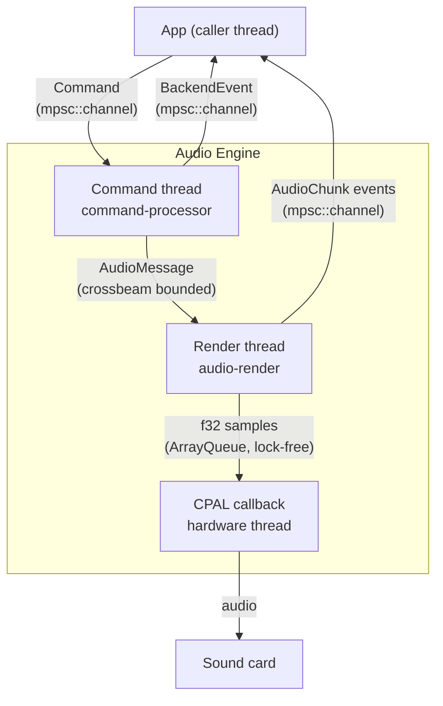
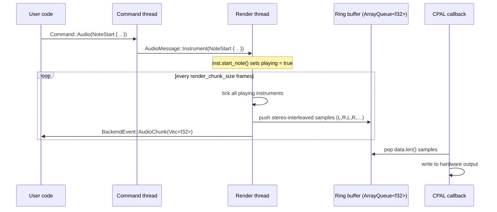

# Rustic

## Project Overview

Rustic is a frontend-agnostic core library for audio synthesis. It provides composable DSP primitives — generators, envelopes, filters, and a node graph — behind a lock-free, real-time-safe audio pipeline. The same engine can be embedded in GUI applications, CLI tools, or test harnesses without modification.

## Architecture

### Thread model

The engine runs four concurrent roles:

| Role | Thread | Responsibility |
|---|---|---|
| **App** | caller | Creates `App`, loads instruments, calls `start()`, sends `Command`s, receives `BackendEvent`s |
| **Command** | `command-processor` | Validates and translates `Command` → `AudioMessage`, maintains graph topology |
| **Render** | `audio-render` | DSP synthesis loop, writes stereo samples to the ring buffer, emits `AudioChunk` events |
| **CPAL callback** | hardware | Pops samples from the ring buffer, writes to the sound card |



### Data flow



### Ring buffer

The ring buffer is a `crossbeam::queue::ArrayQueue<f32>`. Samples are always **stereo-interleaved**: `[L, R, L, R, …]`. The render thread produces two identical samples per mono instrument frame; the CPAL callback consumes exactly `buffer_size × channels` samples per callback. On underrun the callback fills with silence and increments a shared counter.

Default capacity: **8 192 samples** (~93 ms at 44.1 kHz stereo).

### Render modes

The render thread operates in one of two modes, switched via `AudioMessage::SetRenderMode`:

#### Instruments mode (default)

Each `Box<dyn Instrument>` exposes three methods:

```
start_note(note, velocity)  →  sets playing = true, resets generator
stop_note(note)             →  arms release phase
tick()                      →  advances DSP by 1/sample_rate seconds
get_output() → f32          →  returns the latest mono sample
```

Instruments gate their own output with a `playing: bool` field — `tick()` returns 0.0 silently until `start_note` is called, and clears `playing` once `generator.completed()` is true (percussive one-shot behaviour).

The render thread sums all instrument outputs, normalises by instrument count, and duplicates to stereo:

```
mono = Σ inst.get_output() / N
chunk ← [mono, mono]  (for each frame)
```

#### Graph mode

A node graph (`System`) of `Source → Filter → Sink` nodes processes audio as stereo `Frame = [f32; 2]` blocks. The command thread builds and computes the topology, then swaps the compiled graph into the render thread atomically via `AudioMessage::Graph(Swap(system))`. The render thread calls `system.run()` each chunk and reads stereo frames from the sink.

### BackendEvent channel

Both the command thread and the render thread share an `mpsc::Sender<BackendEvent>`. Events received by the caller:

| Variant | Sender | Description |
|---|---|---|
| `AudioStarted { sample_rate }` | Command | Engine is ready |
| `AudioStopped` | Command | Shutdown complete |
| `AudioChunk(Vec<f32>)` | Render | Stereo-interleaved samples from the last chunk — use `.step_by(2)` to extract L or R |
| `BufferUnderrun { count }` | Command | Ring buffer was empty during a callback |
| `CommandError { .. }` | Command | A command failed validation |
| `GraphError { .. }` | Command | Graph topology error (cycle, missing sink, …) |

`AudioChunk` is emitted every chunk (~1 ms at default settings) and is intended for offline analysis and waveform capture. A feature flag to gate it for production use is planned.

## DSP Primitives

### Generators

A `SingleToneGenerator` produces one oscillator voice:
- **Waveform** — `Sine`, `Square`, `Sawtooth`, `Triangle`, `WhiteNoise`
- **FrequencyRelation** — `Ratio`, `Harmonic`, `Semitones`, `Constant`, `Offset` relative to a base frequency
- **Amplitude envelope** — any `dyn Envelope`
- **Pitch envelope** — optional `dyn Envelope` that scales `time_elapsed` per sample

A `MultiToneGenerator` combines multiple `SingleToneGenerator`s under a shared base frequency, optional global amplitude and pitch envelopes, and a `MixMode` (`Sum`, `Average`, `Multiply`, `Max`).

### Envelopes

Envelopes implement `Envelope::at(time: f32, note_off: f32) -> f32`. Built-in segments:

- `LinearSegment(start, end, duration)`
- `BezierSegment(start, end, duration, control_point)`
- `ConstantSegment(value, Option<duration>)`

`ADSREnvelope` composes four segments (attack, decay, sustain, release). The sustain level is the end value of the decay segment.

### Filters (Graph mode)

Filters implement `Filter::process(input: Frame) -> Frame` and optionally `set_parameter(name, value)`:

`LowPassFilter`, `HighPassFilter`, `BandPass`, `GainFilter`, `Clipper`, `Compressor`, `Tremolo`, `DelayFilter`, `MovingAverage`

### Instruments

Instruments wrap a `MultiToneGenerator` (or a graph `System` for more complex voices) and implement the `Instrument` trait. Built-in drum instruments: `Kick`, `Snare`, `HiHat`.
