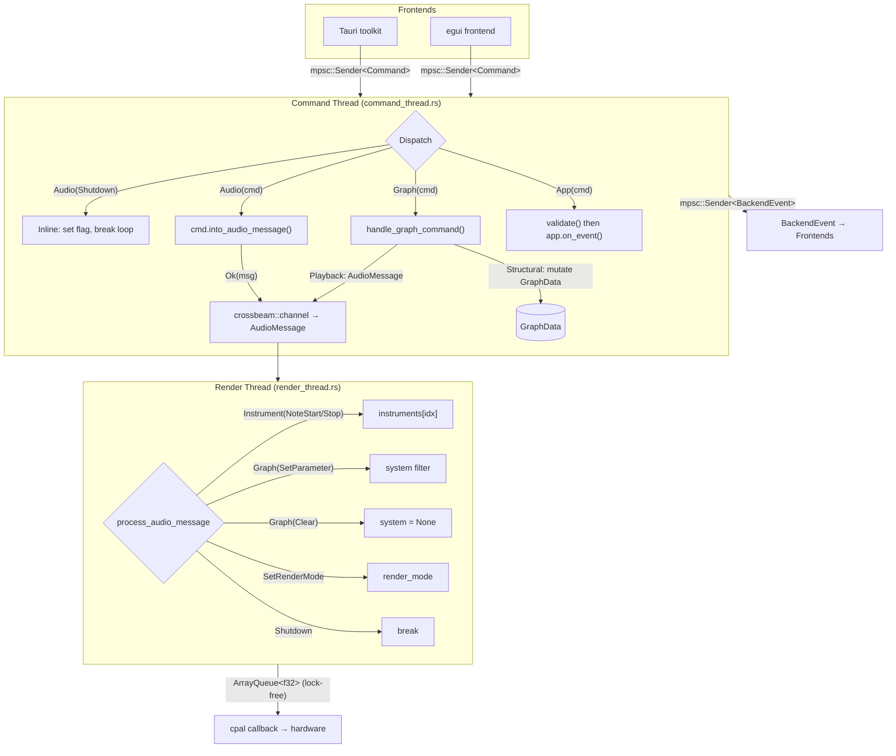
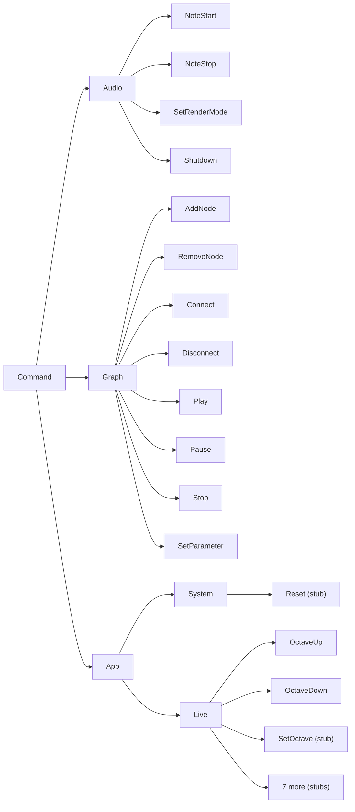

# Command System Reference

## Architecture

## Command Hierarchy

### Dispatch rules

- **`Audio` commands** always produce exactly one `AudioMessage` for the render thread. `into_audio_message()` validates and translates in a single step — no separate `validate()` call, no `unreachable!()` arms.
- **`Graph` commands** are handled by a single `handle_graph_command()`. Structural variants (AddNode, RemoveNode, Connect, Disconnect) mutate `GraphData` in the command thread only. Playback variants (Play, Pause, Stop, SetParameter) also send `AudioMessage`s to the render thread.
- **`App` commands** run `validate()` first, then `app.on_event()`. All match arms are exhaustive — no catch-all `_ => {}`.

---

## AudioCommand

Defined in `commands/mod.rs`. Validated and translated by `into_audio_message()`.

| Variant | Fields | Produces AudioMessage |
|---|---|---|
| `NoteStart` | `note: u8, row: u8, velocity: f32` | `Instrument(NoteStart { instrument_idx, note, velocity })` |
| `NoteStop` | `note: u8, row: u8` | `Instrument(NoteStop { instrument_idx, note })` |
| `SetRenderMode` | `(RenderMode)` | `SetRenderMode(mode)` |
| `Shutdown` | - | `Shutdown` (also sets shared flag, breaks loop) |

---

## GraphCommand

Defined in `commands/graph.rs`. Handled by `handle_graph_command()` in the command thread.

| Variant | Fields | Effect |
|---|---|---|
| `AddNode` | `node_type: String, kind: NodeKind, position: (f32, f32)` | Creates Source/Filter/Sink in `GraphData` |
| `RemoveNode` | `id: u64` | Removes node from `GraphData` |
| `Connect` | `from: u64, from_port: usize, to: u64, to_port: usize` | Connects nodes in the graph |
| `Disconnect` | `from: u64, to: u64` | Disconnects filter-to-filter edge |
| `Play` | - | `system.compute()` then `SetRenderMode(Graph)` |
| `Pause` | - | `SetRenderMode(Instruments)` + `Graph(Clear)` |
| `Stop` | - | `SetRenderMode(Instruments)` + `Graph(Clear)` |
| `SetParameter` | `node_id: u64, param_name: String, value: f32` | `Graph(SetParameter { ... })` to render thread |

`NodeKind`: `Generator`, `Filter`, `Sink`

---

## AppCommand::System

Defined in `commands/system.rs`. Handled by `app.handle_system_command()`.

| Variant | Status |
|---|---|
| `Reset` | **Stub** |

---

## AppCommand::Live

Defined in `commands/live.rs`. Handled by `app.handle_live_command()`.

| Variant | Fields | Validation | Status |
|---|---|---|---|
| `OctaveUp` | `(u8)` row | `row < 2` | Implemented |
| `OctaveDown` | `(u8)` row | `row < 2` | Implemented |
| `SetOctave` | `{ octave: u8, row: u8 }` | `row < 2`, `octave <= 8` | **Stub** |
| `LinkOctaves` | - | - | **Stub** |
| `UnlinkOctaves` | - | - | **Stub** |
| `SelectInstrument` | `{ index: usize, row: u8 }` | - | **Stub** |
| `NextInstrument` | `(u8)` row | - | **Stub** |
| `PreviousInstrument` | `(u8)` row | - | **Stub** |
| `LinkInstruments` | - | - | **Stub** |
| `UnlinkInstruments` | - | - | **Stub** |

---

## AudioMessage (internal)

Sent from command thread to render thread over crossbeam. Never constructed directly by frontends.

| Variant | Render thread action |
|---|---|
| `Instrument(NoteStart { ... })` | `instruments[idx].start_note(note, velocity)` |
| `Instrument(NoteStop { ... })` | `instruments[idx].stop_note(note)` |
| `Graph(SetParameter { ... })` | `system.get_filter_mut(idx).set_parameter(...)` |
| `Graph(Swap(System))` | `*system = Some(new_graph)` (dead code) |
| `Graph(Clear)` | `*system = None` |
| `SetRenderMode(mode)` | Switches between instrument/graph rendering |
| `Shutdown` | Handled via shared flag |

---

## Planned command categories (not yet implemented)

These will be added as `AppCommand` variants when they have working implementations:

- **Loop**: StartRecording, StopRecording, PlayLoop, StopLoop, ClearLoop, ...
- **Mix**: VolumeUp, VolumeDown, SetVolume, Mute, MuteAll
- **Performance**: PitchBend, Vibrato, Tremolo
- **Effect**: Reverb, Delay, Chorus, Filter, Distortion
- **Settings**: KeyboardLayout, Metronome, Tempo, Sessions, OutputDevice