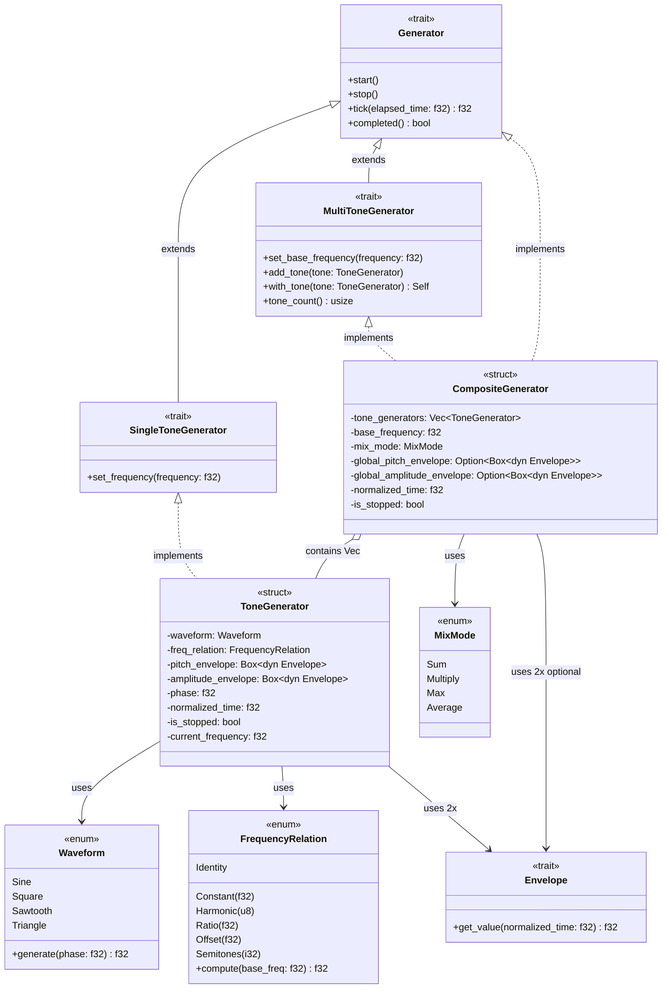

# Generators

This mod contains the generator code for the project.

```mermaid
classDiagram
    class Generator {
        <<trait>>
        +start()
        +stop()
        +tick(elapsed_time: f32) f32
        +completed() bool
    }
    
    class SingleToneGenerator {
        <<trait>>
        +set_frequency(frequency: f32)
    }
    
    class MultiToneGenerator {
        <<trait>>
        +set_base_frequency(frequency: f32)
        +add_tone(tone: ToneGenerator)
        +with_tone(tone: ToneGenerator) Self
        +tone_count() usize
    }
    
    class Envelope {
        <<trait>>
        +get_value(normalized_time: f32) f32
    }
    
    class Waveform {
        <<enum>>
        Sine
        Square
        Sawtooth
        Triangle
        +generate(phase: f32) f32
    }
    
    class FrequencyRelation {
        <<enum>>
        Identity
        Constant(f32)
        Harmonic(u8)
        Ratio(f32)
        Offset(f32)
        Semitones(i32)
        +compute(base_freq: f32) f32
    }
    
    class MixMode {
        <<enum>>
        Sum
        Multiply
        Max
        Average
    }
    
    class ToneGenerator {
        <<struct>>
        -waveform: Waveform
        -freq_relation: FrequencyRelation
        -pitch_envelope: Box~dyn Envelope~
        -amplitude_envelope: Box~dyn Envelope~
        -phase: f32
        -normalized_time: f32
        -is_stopped: bool
        -current_frequency: f32
    }
    
    class CompositeGenerator {
        <<struct>>
        -tone_generators: Vec~ToneGenerator~
        -base_frequency: f32
        -mix_mode: MixMode
        -global_pitch_envelope: Option~Box~dyn Envelope~~
        -global_amplitude_envelope: Option~Box~dyn Envelope~~
        -normalized_time: f32
        -is_stopped: bool
    }
    
    Generator <|-- SingleToneGenerator : extends
    Generator <|-- MultiToneGenerator : extends
    
    SingleToneGenerator <|.. ToneGenerator : implements
    Generator <|.. CompositeGenerator : implements
    MultiToneGenerator <|.. CompositeGenerator : implements
    
    ToneGenerator --> Waveform : uses
    ToneGenerator --> FrequencyRelation : uses
    ToneGenerator --> Envelope : uses 2x
    
    CompositeGenerator o-- ToneGenerator : contains Vec
    CompositeGenerator --> MixMode : uses
    CompositeGenerator --> Envelope : uses 2x optional
```